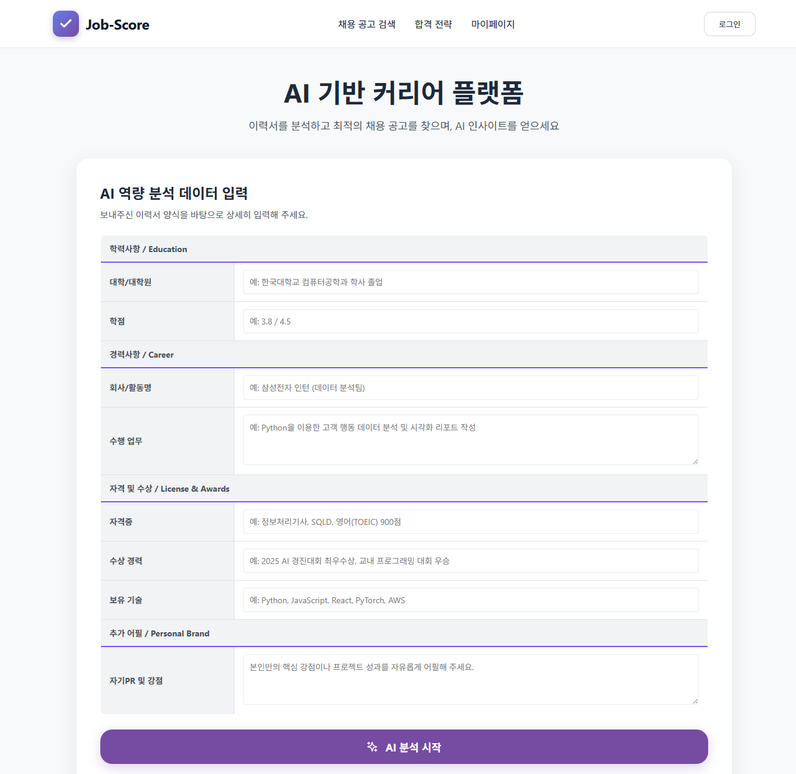
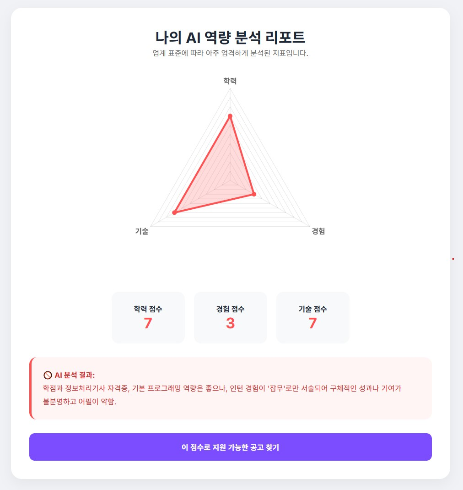
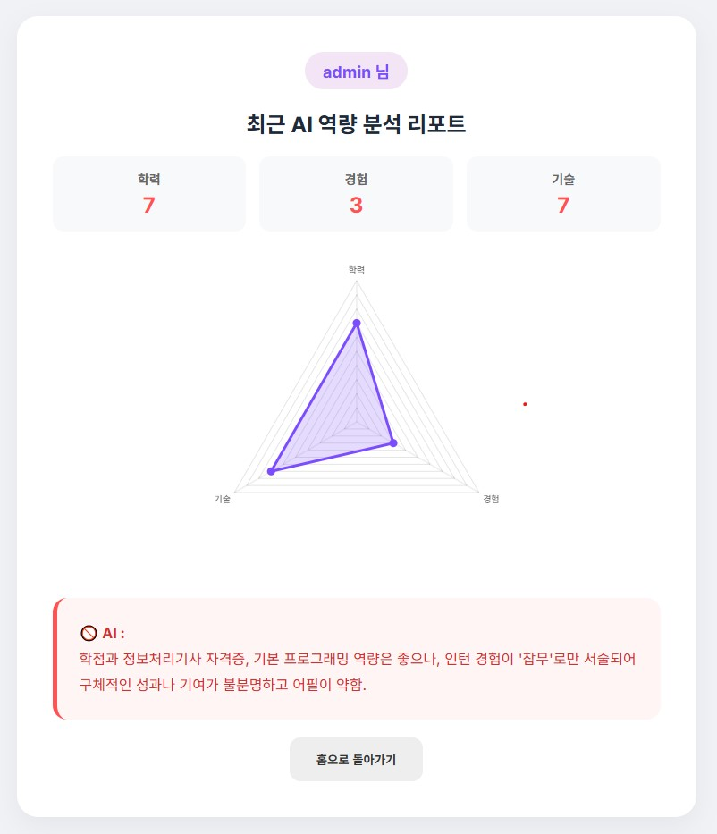

# 🎯 JobScore
**내 역량과 채용 공고를 한눈에 비교하는 스마트 매칭 서비스.**

JobScore는 취업 준비생이 자신의 **역량 데이터와 채용 공고를 입력하면**,  
서버에서 이를 정밀 분석하여 개인 맞춤형 매칭 점수를 산출하고,  
**'이중 레이더 차트'**를 통해 직관적인 시각화 결과를 제공하는 웹 서비스입니다.

일상에서 취업을 준비하며  
“이 공고, 과연 내 스펙으로 지원해도 괜찮은 걸까?”  
라는 막연한 고민과 시간 낭비를 줄이기 위해 만들어졌습니다.

  
  
  

---

## 🔎 한눈에 보는 JobScore
- 📊 **역량 vs 공고 요구치 '이중 레이더 차트' 시각화**
- 🧑‍💻 **내 정보 기반 맞춤형 취업 전략 가이드 제공**
- 🔐 **안정적인 사용자 인증 및 프로필 관리**  
- 📜 **스크롤 가능한 상세 분석 결과 화면**
- 🤖 **Gemini API 기반 역량 분석 및 매칭 로직**
- 🧪 현재는 **IT 직군 중심** 분석 지원 (향후 타 직군 확장 예정)

---

## 📽️ 데모 영상
JobScore의 실제 동작 흐름은 아래 데모 영상에서 확인할 수 있습니다.

---

## 🖼️ 웹 실행 화면

| 메인 화면 | 분석 결과 (차트) | 마이 페이지 |
|---|---|---|
|  |  |  |

---

## ⚙️ 주요 기능 소개

### 📊 Chart.js 기반 이중 레이더 차트
- 사용자의 보유 역량과 채용 공고의 요구 스펙을 비교할 수 있는 삼각형 모양의 '이중 레이더 차트'를 커스텀 구현했습니다.
- 데이터 시각화를 통해 본인의 부족한 점과 강점을 직관적으로 파악할 수 있습니다.

---

### 🧑‍💻 개인 맞춤형 합격 전략 분석
JobScore는 단순한 점수 제공을 넘어,  
**사용자의 직무 역량 데이터를 고려한 안내**를 목표로 합니다.

- 유저 보유 스펙 데이터
- 채용 공고 요구 스펙 데이터

위 정보를 바탕으로 일반적인 결과 분석에 **AI가 생성한 개인화된 합격 전략 문장을 추가**해 안내합니다.

---

### 🔐 프로필 및 인증 관리  
- 사용자가 로그인하면 메인 화면의 UI가 유기적으로 전환되도록 구현했습니다.  
  (로그인 버튼 ➡️ 로그아웃 및 프로필 아이콘 노출)  
- 마이페이지를 통해 내 역량 지표를 지속적으로 모니터링할 수 있습니다.  

---

### 📜 결과 화면 스크롤 지원
- 분석 정보와 주의사항 및 피드백 텍스트가 길어질 경우를 고려  
- 결과 화면 전체를 **스크롤로 확인 가능**

---

## 🧩 시스템 구조 (Architecture)
JobScore는 **웹 프론트엔드와 Node.js 서버로 구성된 클라이언트–서버 구조**로 동작합니다.  
클라이언트에서 입력된 역량 및 공고 데이터는 서버로 전달되며,  
서버는 Gemini API를 통해 데이터를 분석한 뒤 결과를 다시 화면(클라이언트)으로 반환합니다.

---

## ▶️ 실행 및 접속 방법 (How to Run & Access)

JobScore는 구글 Gemini API를 사용하는 서버와 연동되어 동작합니다. 

### 🌐 배포 주소 바로 접속 (추천)
이미 클라우드 환경(Render)에 모든 서버와 API 설정이 완료되어 있습니다. 별도의 설치나 API 키 발급 없이 아래 링크를 통해 즉시 서비스를 이용하실 수 있습니다.
👉 **[JobScore 웹 서비스 바로가기](https://jobscore.onrender.com)** <!-- 여기에 네 실제 배포 주소를 넣어줘! -->

### 💻 개발자 로컬 실행 안내
만약 본 프로젝트를 로컬 환경에 다운로드하여 직접 구동해보고 싶으신 개발자분들은 아래 절차를 참고해 주시기 바랍니다. 
*(보안 및 비용 문제로 인해 API 키는 저장소에 포함되어 있지 않습니다.)*

1. 구글 AI 스튜디오에서 Gemini API 키를 발급합니다.
2. 프로젝트 루트 디렉토리에 `.env` 파일을 생성하고 API 키를 등록합니다.  
   `GEMINI_API_KEY=your_api_key_here`
3. 의존성 라이브러리를 설치합니다.  
   `npm install`
4. Node.js 서버를 실행합니다.  
   `node server.js`
- 현재 무료 플랜(Render) 배포 특성상, 일정 시간 동안 접속이 없으면 초기 접속 시 약 50초 내외의 서버 깨우기(Spin-down) 대기 시간이 발생할 수 있습니다.
